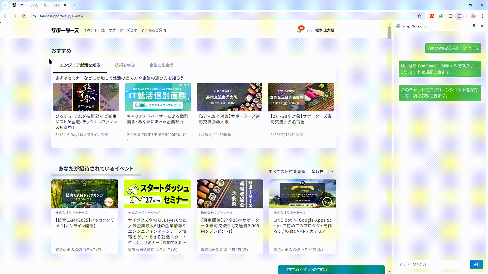

## Hi there 👋
<!--
**Naoto-Araki/Naoto-Araki** is a ✨ _special_ ✨ repository because its `README.md` (this file) appears on your GitHub profile.

Here are some ideas to get you started:

- 🔭 I’m currently working on ...
- 🌱 I’m currently learning ...
- 👯 I’m looking to collaborate on ...
- 🤔 I’m looking for help with ...
- 💬 Ask me about ...
- 📫 How to reach me: ...
- 😄 Pronouns: ...
- ⚡ Fun fact: ...
-->
👨‍🎓 I’m currently a student at Osaka University

👨‍💻I'm working on an intership at [six1](https://six1.jp/)

  

## Stats

  

  

  

## Hackathon
### 📌 [技育CAMP2024 ハッカソン Vol.22](https://talent.supporterz.jp/events/21ff01e0-4e23-4758-9e08-b50c29c51860/)（2025年2月）

結果は優秀賞を受賞しました

- Githubレポジトリは[こちら](https://github.com/MRyutaro/SnapNoteClip)
- 発表用スライドは[こちら](https://speakerdeck.com/ryutarom/ji-yu-camp2024-vol-dot-22-snapnoteclip)

**使用した技術**
- JavaScript
- HTML
- CSS
