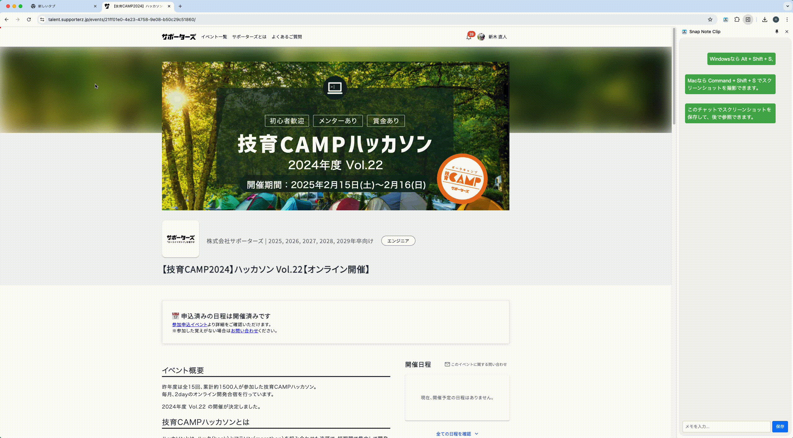

## Hi there 👋
<!--
**Naoto-Araki/Naoto-Araki** is a ✨ _special_ ✨ repository because its `README.md` (this file) appears on your GitHub profile.

Here are some ideas to get you started:

- 🔭 I’m currently working on ...
- 🌱 I’m currently learning ...
- 👯 I’m looking to collaborate on ...
- 🤔 I’m looking for help with ...
- 💬 Ask me about ...
- 📫 How to reach me: ...
- 😄 Pronouns: ...
- ⚡ Fun fact: ...
-->
👨‍🎓 I’m currently a student at Osaka University

👨‍💻 I worked as a software engineering intern at [six1](https://six1.jp/) from October 2024 to September 2025.

😄 This is my [portfolio](https://naoto-portfolio-alpha-blue.vercel.app/)

  

## Stats

    
  

  

## Hackathon
### 📌 [技育CAMP2024 ハッカソン Vol.22](https://talent.supporterz.jp/events/21ff01e0-4e23-4758-9e08-b50c29c51860/)（2025年2月）

ページの指定範囲を切り取って記録し、メモ付きのノートを作成できるChrome拡張機能です。

主な機能は以下の通りです。
- 開いているタブのスクリーンショットの取得
- 任意のメモの入力・保存
- サイドバーでのスクリーンショット・メモの一覧表示
- ローカルストレージへの保存および削除
- スクリーンショット画像の拡大表示
- スクリーンショットをクリックして該当タブへのジャンプ

結果は優秀賞を受賞しました
- Githubレポジトリは[こちら](https://github.com/MRyutaro/SnapNoteClip)
- 発表用スライドは[こちら](https://speakerdeck.com/ryutarom/ji-yu-camp2024-vol-dot-22-snapnoteclip)

**使用した技術**
- JavaScript
- HTML
- CSS

## Conference
- 新木直人，村田忠彦  
  「PLATEAUの建築物属性と国勢調査の住居・居住地統計を考慮した合成世帯割当て手法」(査読付き)  
  計測自動制御学会 社会システム部会 第37回研究会（沖縄県石垣市，2025年3月13〜15日）

- 新木直人，村田忠彦  
  「合成人口データを用いた居住地割当の改良」  
  計測自動制御学会 社会システム部会 第36回研究会（オンライン，2024年9月1〜2日）
