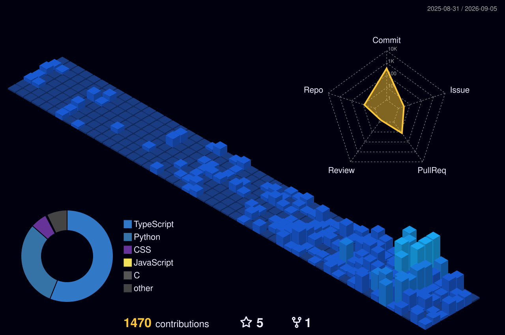
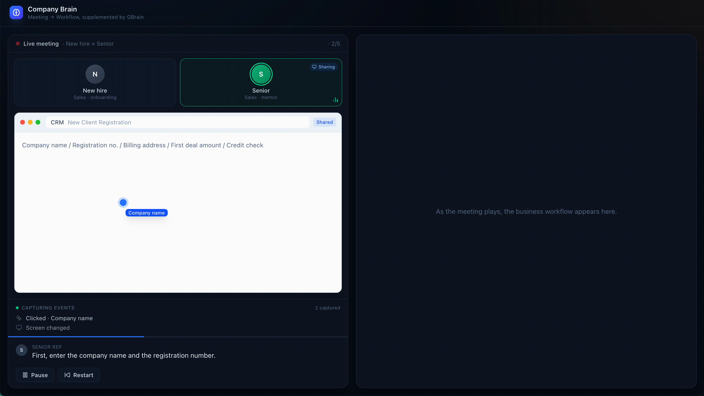
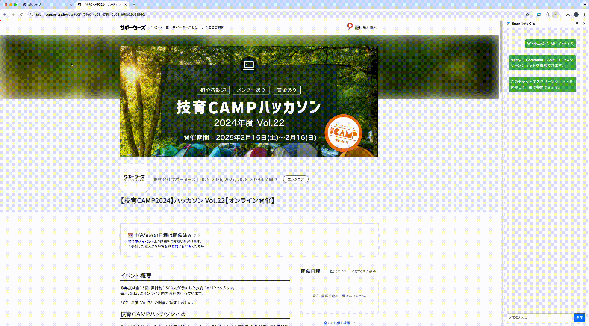

## Hi there 👋
Master's Student at Osaka University | Graduate School of Information Science and Technology

### Career
* **Software Engineering Intern** at [six1](https://six1.jp/) (Oct 2024 – Sep 2025), Fully remote
* **Software Engineering Intern** at [GMO Internet Group, Inc.](https://group.gmo/) (Aug 2025 – Sep 2025), On-site in Osaka, Japan
* **Software Engineering Intern** at [Asahi Broadcasting Group Holdings Corporation](https://corp.asahi.co.jp/ja/) (Aug 2025 – Sep 2025), On-site in Osaka, Japan

  
  

    

  

## Hackathon
### 📌 [YC | RFS - Summer 2026 | AI Hackathon](https://luma.com/compiled-4qzo?tk=9RGzOV)（2026年7月）
<table>
  <tr>
    <td width="50%">
      
    </td>
    <td width="50%" style="vertical-align: top;">
      <h3>Company Brainテーマでの開発</h3>
      
業務説明や操作ログをもとに、社内知識と照合しながら業務ワークフローを生成するプロトタイプ

      <ul>
        <li>YC RFSテーマAIハッカソンに参加</li>
        <li>Chrome拡張機能で会議中の発話・クリック・画面情報を取得</li>
        <li>GeminiとGBrainを用いて曖昧な業務知識を補完</li>
      </ul>
      

        <a href="https://github.com/arakink/company-brain-yc-hackathon">GitHubリポジトリ</a>
        ・
        <a href="https://company-brain-yc-hackathon.vercel.app/">デモサイト</a>
         
        <a href="https://company-brain-yc-hackathon.vercel.app/youtube">デモ動画</a>
        ・
        <a href="https://qiita.com/arakink/items/b72d5cc7eb4d694fc12f29fbe92364c73">Qiita記事</a>
      

    </td>
  </tr>
</table>

### 📌 [技育CAMP2024 ハッカソン Vol.22](https://talent.supporterz.jp/events/21ff01e0-4e23-4758-9e08-b50c29c51860/)（2025年2月）
<table>
  <tr>
    <td width="50%">
      
    </td>
    <td width="50%" style="vertical-align: top;">
      <h3>SnapNoteClipの特徴</h3>
      
ページの指定範囲を切り取って記録し、メモ付きのノートを作成できるChrome拡張機能

      <ul>
        <li>優秀賞受賞</li>
        <li>直感的な範囲選択UI</li>
      </ul>
      
<a href="https://github.com/MRyutaro/SnapNoteClip">GitHubリポジトリ</a>

      
<a href="https://speakerdeck.com/ryutarom/ji-yu-camp2024-vol-dot-22-snapnoteclip">発表用スライド</a>

    </td>
  </tr>
</table>

## Conference
- 新木直人，村田忠彦  
  「PLATEAUの建築物属性と国勢調査の住居・居住地統計を考慮した合成世帯割当て手法」
  計測自動制御学会 社会システム部会 第37回研究会（沖縄県石垣市，2025年3月13〜15日）

- 新木直人，村田忠彦  
  「合成人口データを用いた居住地割当の改良」  
  計測自動制御学会 社会システム部会 第36回研究会（オンライン，2024年9月1〜2日）
